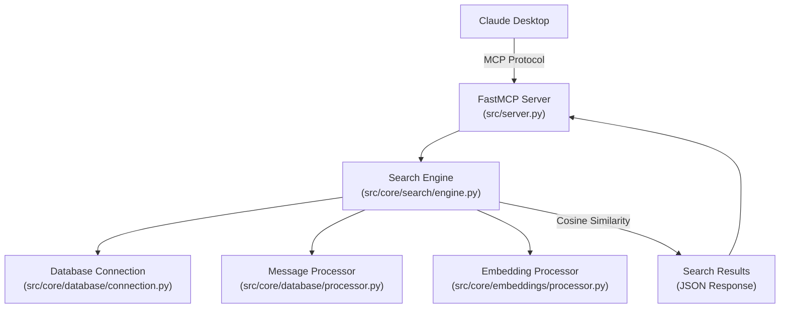
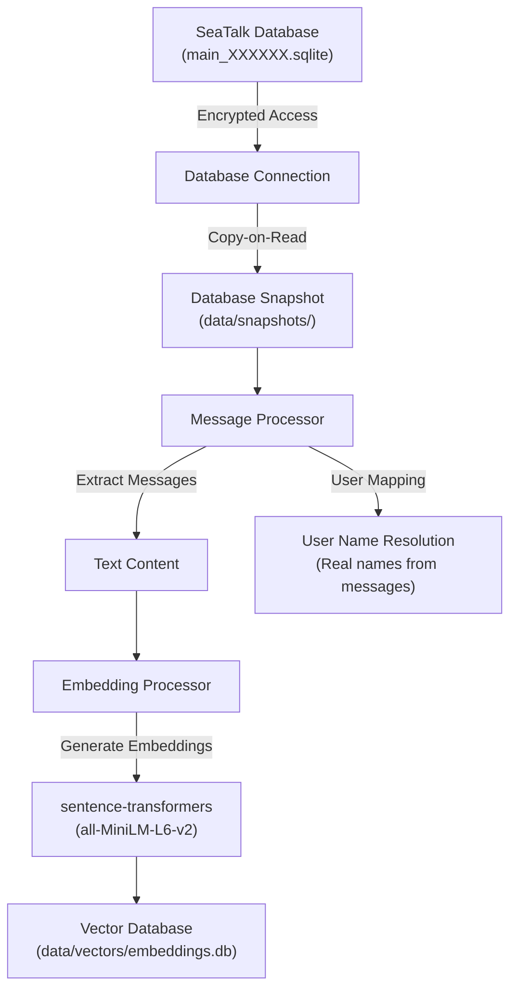
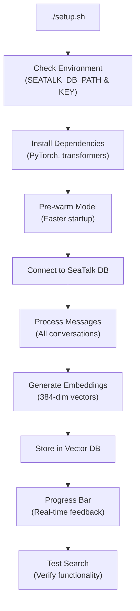
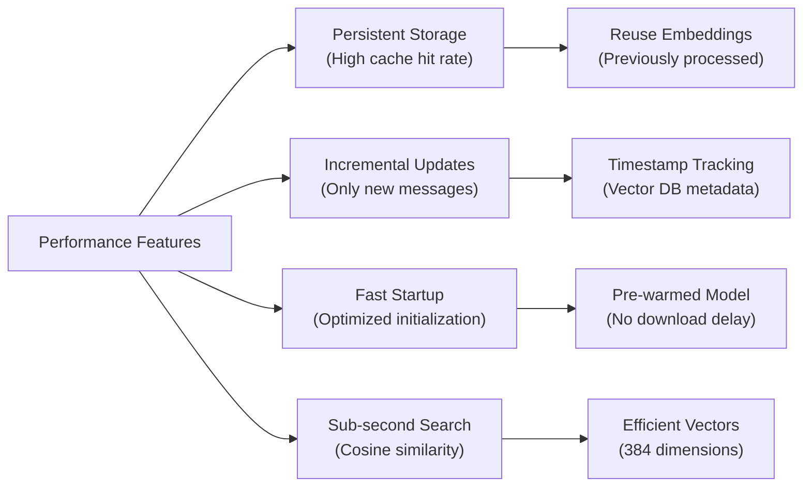

# 🔍 msg-vector-search

MCP (Model Context Protocol) server that enables Claude Desktop to search through your SeaTalk conversations using semantic vector search.

## Overview

This tool integrates with Claude Desktop to provide intelligent search capabilities for your SeaTalk conversations:

1. **Semantic Search**: Uses vector embeddings (all-MiniLM-L6-v2 model) to understand meaning, not just keywords
2. **Local Processing**: All data stays on your computer - complete privacy
3. **Automatic Integration**: Works seamlessly through Claude Desktop's MCP interface
4. **Smart Results**: Finds relevant conversations even when exact words don't match

Ask Claude natural questions about your conversations and get contextually relevant results!

> **What is MCP?** The Model Context Protocol (MCP) allows Claude Desktop to securely connect to external tools and data sources. This enables Claude to help you with tasks that require access to your local files and applications.

## 📋 Prerequisites

* **uv** package manager: Install with `curl -LsSf https://astral.sh/uv/install.sh | sh`
* **SeaTalk app** installed on macOS
* **Claude Desktop** app
* **Python 3.10+** (automatically managed by uv)
* **Compatible with both Intel and Apple Silicon Macs**

## 🔧 Installation

**Step 1: Clone the repository**

```bash
git clone https://github.com/agentcluck77/msg-vector-search.git
cd msg-vector-search
```

**Step 2: Get your SeaTalk database key**

The database key must be obtained from your SeaTalk administrator. It is not embedded in filenames or discoverable through the filesystem.

**Step 3: Run setup with full initialization**

```bash
# Replace YOUR_DB_KEY with your actual SeaTalk database key
SEATALK_DB_PATH="/Users/$(whoami)/Library/Application Support/SeaTalk" \
SEATALK_DB_KEY="YOUR_DB_KEY" \
./setup.sh
```

This will:
- Install all dependencies (PyTorch, sentence-transformers, etc.)
- Pre-warm the AI model for fast startup
- Connect to your SeaTalk database and create embeddings
- Show progress with a real-time progress bar
- Verify everything works with a test search

**Alternative: Dependencies-only setup**

If you prefer to set up the database later:
```bash
./setup.sh
```

This installs dependencies but skips database initialization. The first MCP call will then initialize the database (may take 30-60 seconds).

**Verify installation:**

```bash
uvx --from . seatalk-search-server --help
```

## ⚙️ Configuration

Configure the tool by adding it to your Claude Desktop MCP configuration file.

**Location of Claude Desktop config file:**

* **macOS**: `~/Library/Application Support/Claude/claude_desktop_config.json`

**Add this configuration:**

```json
{
  "mcpServers": {
    "seatalk-search": {
      "command": "/Users/YOUR_USERNAME/.local/bin/uvx",
      "args": [
        "--from",
        "/path/to/msg-vector-search",
        "seatalk-search-server"
      ],
      "env": {
        "SEATALK_DB_PATH": "/Users/YOUR_USERNAME/Library/Application Support/SeaTalk",
        "SEATALK_DB_KEY": "your-seatalk-db-key",
        "SEATALK_EMBEDDING_THRESHOLD": "50"
      }
    }
  }
}
```

**Replace the following:**

* `YOUR_USERNAME` - Your actual macOS username
* `/path/to/msg-vector-search` - Full path to where you cloned this repository
* `your-seatalk-db-key` - Your actual SeaTalk database key

**Configuration Options:**

* `SEATALK_DB_PATH` - Path to SeaTalk database directory (required)
* `SEATALK_DB_KEY` - Database decryption key (required)
* `SEATALK_EMBEDDING_THRESHOLD` - Minimum new messages to trigger embedding update (optional, default: 10)

**Performance Tuning:**

The `SEATALK_EMBEDDING_THRESHOLD` controls when embeddings are updated during search:

* **Lower values (1-10)**: More responsive to new messages, but may cause delays during active chat periods
* **Higher values (50-100)**: Faster searches during active use, but newer messages may not appear in results immediately
* **Recommended**: 10-50 depending on your SeaTalk usage patterns

**Get your SeaTalk database key:**

The database key must be obtained from your SeaTalk administrator (same key used in installation Step 2). It is not embedded in filenames or discoverable through the filesystem.

**After configuration:**

1. Save the config file
2. Restart Claude Desktop
3. The tool will be available for Claude to use automatically

## 🚀 Usage

Once configured, the tool works automatically with Claude Desktop. Simply ask Claude questions about your SeaTalk conversations:

### Example Queries

* _"Find conversations where we discussed the project timeline"_
* _"When did we last talk about the budget?"_
* _"Show me messages about the design review"_
* _"What did the team say about the new feature?"_
* _"Find discussions about deadlines or milestones"_

### How it Works

1. You ask Claude a question about your conversations
2. Claude automatically uses this tool to search your SeaTalk messages
3. Results are returned based on semantic similarity, not just keyword matching
4. Claude provides you with relevant conversation excerpts and context

**Note:** All processing happens locally on your computer. Your messages never leave your device.

## 🏗️ Technical Architecture

### Core System Architecture



### Database & Storage Flow



### Setup & Initialization Process



### Performance Optimizations



## 🔧 Technical Details

- **Model**: sentence-transformers/all-MiniLM-L6-v2
- **Vector Dimension**: 384
- **Similarity**: Cosine similarity with configurable threshold
- **Database**: SQLite with APSW for encrypted SeaTalk databases
- **Performance**: ~300-400 messages/second for embedding generation

## 🐛 Troubleshooting

### Installation Issues

**Setup Script Issues:**

1. **Ensure uv is installed**: `curl -LsSf https://astral.sh/uv/install.sh | sh`
2. **Re-run setup**: `./setup.sh`
3. **Check PATH**: Restart your terminal after installing uv

**NumPy Compatibility Issues:**

If you see NumPy 2.x compatibility errors:
```bash
# Clear UV cache and reinstall
rm -rf ~/.cache/uv
./setup.sh
```

This project pins NumPy to 1.x for PyTorch compatibility. The setup script will detect and handle version conflicts automatically.

### Claude Desktop Integration Issues

**Tool Not Available in Claude:**

1. **Check config file location and syntax**:  
   * Ensure `claude_desktop_config.json` is in the correct location  
   * Validate JSON syntax (use a JSON validator)  
   * Verify the paths in the configuration are correct
2. **Verify installation**:  
   ```bash
   uvx --from . seatalk-search-server --help
   ```
3. **Restart Claude Desktop** after making config changes

**Configuration Issues:**

* Verify `SEATALK_DB_PATH` path exists and contains SeaTalk data
* Check `SEATALK_DB_KEY` is correct (look for `main_XXXXXX.sqlite` files)
* Ensure the tool has read access to the SeaTalk folder

**"Database not connected" errors:**
- Make sure your `SEATALK_DB_KEY` is correct
- Verify the SeaTalk database path exists
- Run `./setup.sh` again to verify installation

**Still having issues?**

* Check Claude Desktop's logs for MCP connection errors
* Test the command manually to see specific error messages

## 📄 License

MIT License

## 🤝 Contributing

1. Fork the repository
2. Create a feature branch: `git checkout -b feature-name`
3. Make your changes and test: `./setup.sh`
4. Submit a pull request

For issues or questions, please open an issue on GitHub. # AAV-perception-diagrams
